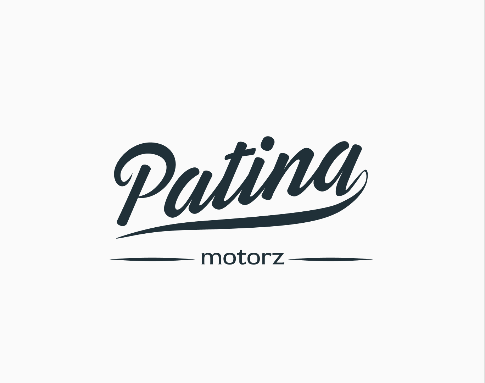
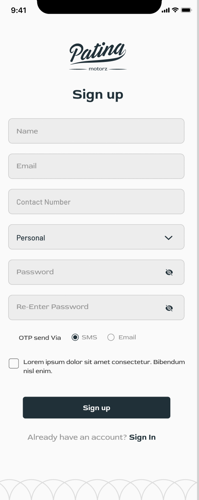
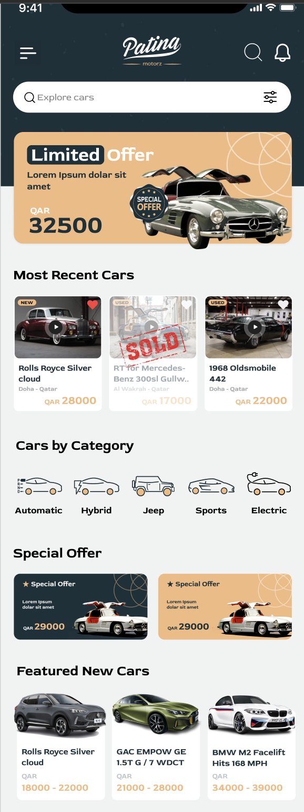
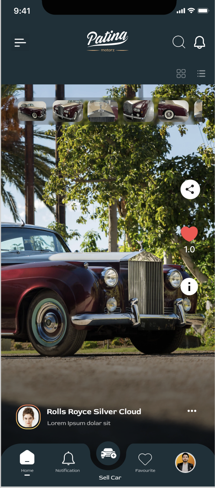
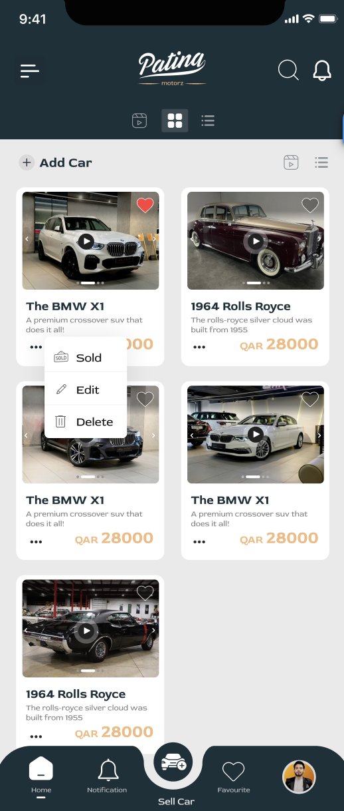
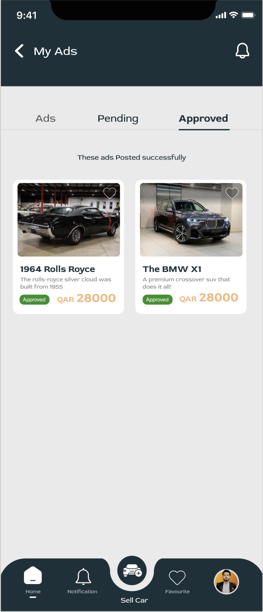
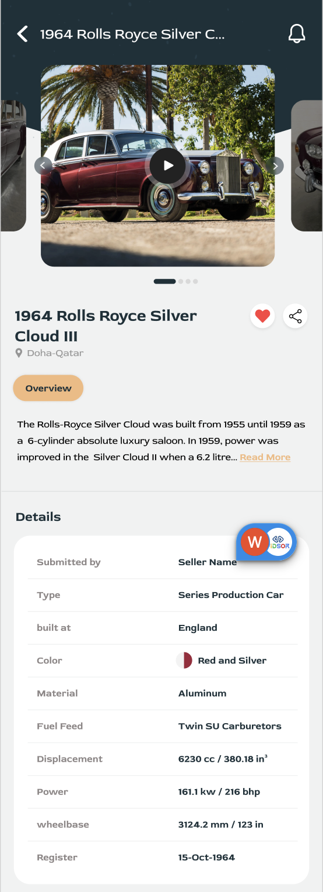
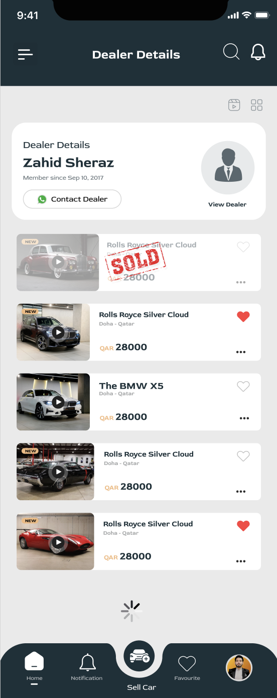
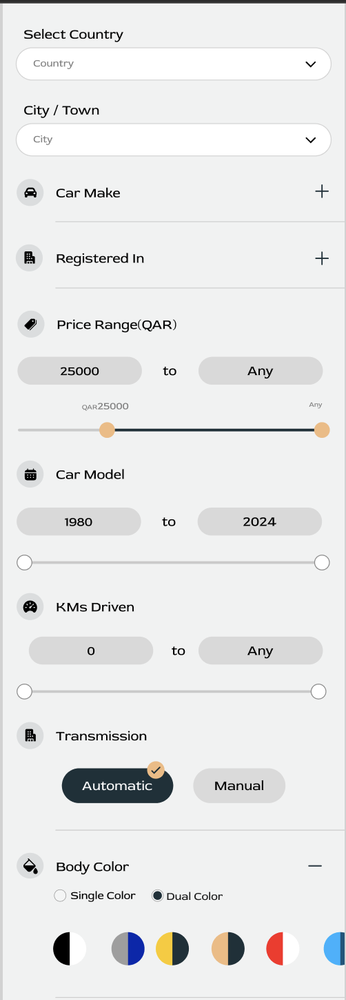
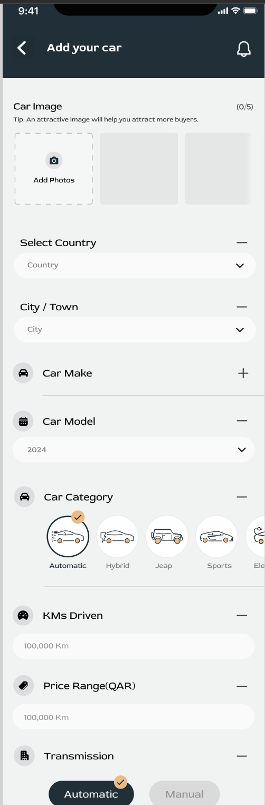

# Patina Motorz ✨🚘

# Description

**_Patina Motorz_** is a VIP Cars Classifieds Platform dedicated to listing exclusive vehicles for discerning enthusiasts. The platform offers a range of features tailored to the luxury car market, including dynamic listing options, multiple user types such as personal, collector, and dealer profiles, package-based advertising, car reels, and integrated chat functionalities. With Patina Motorz, users can seamlessly buy and sell high-end vehicles, enhancing their experience in the world of luxury automobiles.

## Responsibilites

- Led backend development for Patina Motorz, a VIP Cars Classifieds Platform catering to exclusive vehicles buy & sell platform for discerning enthusiasts.

- Developed and optimized comprehensive backend systems to support dynamic listing options, multiple user types (personal, collector, and dealer profiles), and package-based advertising.

- Implemented advanced features such as car reels and integrated chat functionalities, ensuring a seamless and enhanced user experience in the luxury car market.

- Integrated 3rd party plugins such as notifications, SMS | Whatsapp messages providers and others.

- Ensured CI/CD of the project (Docker, Gitlab CI/CD pipelines, AWS EB).

## Used Technologies

- FastifyJS (Node.js framework)
- PostgreSQL.
- Amazon web services.
  - EC2
  - S3
  - RDS.
  - Auto scaling.
  - Elastic Beanstalk.

## Some App Screenshots

  
  
  
  
  
  
  
  
  
